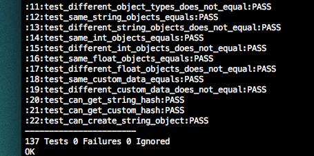

Title: C# Inspired Collection Library for C
Author: Ulrik Damm & Kristian Andersen
Email: ksma@itu.dk
Date: May 22, 2013

# Table of Contents

* [Preface][section-preface]
* [Introduction][section-introduction]
	- [Existing libraries][section-existing]
	- [Vision][section-vision]
* [Architecture][section-architecture]
	- [Memory Management][section-memorymanagement]
	- [Data Objects][section-dataobjects]
	- [Code Structure][section-codestructure]
	- [API][section-api]
	- [Testing][section-testing]
	- [Error Handling][section-error-handling]
* [Implementation][section-implementation]
	- [Performance][section-performance]
	- [Testing][section-testing-impl]

# Preface [section-preface]
This report has been written in May 2013 in a 15 ECTS project at the IT University of Copenhagen under the supervision of Hans Henrik Brandenborg Sørensen and Peter Sestoft.

During the project we developed a collection library for the programming language C. The library is strongly inspired by standard libraries found on the .NET and Java platforms. The library mimics characteristics and concepts traditionally only found in collection libraries for modern Object Oriented programming languages. These traits include garbage collected data structures, enumerations, collection filters and more. The library also adheres to the same level of consistency and documentation that is customary for OO-language collection libraries but uncommon for C libraries.

# Introduction [section-introduction]

Data structures are a natural asset in the development of any application. Unlike many languages, C does not come with a full range of data structures, neatly packaged together into a collection library. In fact there is not a single data structure in the standard library. Developers find themselves faced with two options. Either write the implementation you need from scratch or go online and find an existing implementation that looks usable.

Developers find themselves scouring the web for good libraries and are left with a number of choices. None of the many options available are very much alike the typical modern OO-language collection library. 

Languages like Java and C# are highly regarded in part because of their extensive, well-documented and loved collection libraries that come as part of their standard libraries. Developers who primarily develop with languages like these are left with no similar options in C.

The overall purpose of this project is to investigate how a collection library written for C might be inspired by other libraries from object-oriented programming languages like C#. 

## Existing libraries [section-existing]

There is a large number of libraries with data structures available for C. The table below is lists some of  the most commonly known by C developers.

| Library | Documentation  | Naming | Memory | Avail. ADTS |
-------|----------------|--------|--------|----------------|
GDSL   | Good, no ex    | Good   | None   | Decent         |
GLib   | Good           | Incons.| None   | Few            |
APR    | Bad            | Incons.| Partly | Few            |
NPR    | Chaotic, no ex | Good   | No     | Many           |
SGLIB  | Good           | Bad    | No     | Many           |
Gnulib | Good           | Bad    | ?      | Many           |
LibDS  | Good, no ex    | Bad    | No     | Decent         |
[Existing solutions for ADT's]

Most of the libraries listed here are not strictly collection libraries but larger libraries where a small part of it is data structures. This is the case for APR, NPR, Glib and Gnulib. 

Finding libraries purely dedicated to data structures is not very easy. We were only able to locate GDSL, SGLIB and LibDS. All of these have one thing in common; no memory management. In fact most of the libraries have no memory management support, which means the developer has to manage the memory manually. All C developers are used to this fact, but it is very uncommon for developers using OO-languages to manage memory themselves.

An intricate part of any library is testing. The libraries from our research have varying degrees of testing implemented. Some have a few tests per data structure. A few have full-blown test suites with all public functionality tested. A single claims to have high-coverage unit tests, but is closed source. A lot of have no tests or no tests checked in to the public source.

All the libraries have varying quality of documentation and naming conventions. These two qualities are crucial factors for the entire quality of a library.

Many leaps has happened in computer science since C had its peak, let alone was invented. However it seems that not many of the advancements made in collection libraries in newer programming languages has found their way into C. There could be several explanations for this. Consider this: many of the newer features doesn't mix well with the non-object-oriented nature of C.

## Vision [section-vision]
In examining the existing libraries containing data structures available for C, it is found that there is room for improvement.  This project will aim to describe and implement a dedicated collection library for C that fills some of the gap between existing solutions for C and the OO-languages.

This library will consist of a small selection of commonly used data structures. The data structures that will be implemented are as follows:

* Linked list
* Array list (also known as vector)
* Queue
* Stack
* Set (unique value store)
* Dictionary (hashed key-value store)
* Sorted list
* Sorted set
* Sorted dictionary
* Binary tree

In addition to the features that would normally be associated with common data structures like those mentioned above, the library will aim to implement a number of concepts and features inspired by other OO libraries. Most notably the data structures will all have support for enumeration, something that none of the existing libraries for C has. The library will also aim to be very easy to extend with additional features, types and structures. This will be done with the means of solid code conventions, good documentation and unit testing.

Following code conventions is always good sense when writing library code but it becomes even more important with C because of the lack of modularity in C. There are no namespaces, packages or classes into which functions can be neatly organized.

Just as important as code conventions is documentation. A library must have a well documented API for developers to easily use it. A library must also be well documented internally for developers to easily extend it.

To further mimic the trades of libraries from other libraries the library of this project will support garbage collection. Memory is manually managed in C and removing that concern from the developers when they deal with collection libraries will make the library even more usable.

# Architecture [section-architecture]

There are generally two different approaches to designing a system in procedural programming languages. The first is the "classic" way, where you would have a single function doing one task on all the supported data types. The other is the more modern object-oriented way of having one implementation of a task for each supported data type. An example of the difference could be a method, which will calculate the weight of a car: the classic method would have a single function with support for all known types of cars; the object-oriented would have one specialized function on each car type. Each approach has pros and cons. If you want to add a car type, in the classic method, you would have to find every place in the code where car-type-specific calculations were made, while in the object oriented, you would only need to implement the functions for the new car type. On the other hand, if you wanted to have a function to calculate the height of a car, in the classic approach, you would need to implement just one function, where in the object-oriented approach, you would have to find all car types, and implement a function for each.

Newer languages with focus on object oriented programming makes the decision of which to use very easy. In pre-object languages, such as C, the choice is a bit harder. The easy answer is to use the classic way, since this is what the language is built for; however, there are ways to build functionality which replicates some object-oriented functions in a procedural way, which makes object composition available.

One other difference between the two approaches is execution speed. The newer, more dynamic ways of programming uses a lot of dynamic lookup at runtime, which has a performance impact, compared to more static programming. If you compare the same code written in C and C++, the C++ code will most likely be a bit slower, since dynamic features like method calls uses runtime table lookups. A more extreme example is languages like JavaScript, which, even when compiled to bytecode, runs at half the speed of the same C program. [remember source, that article with asm.js and Unreal Engine]

There isn't a single general answer to, which method is the best to use. It depends on the specific situation. What we can do, is that we can set a general style for the project as a guideline, not a rule. The general style should be prioritized over the other, but if one doesn't make sense to use in a situation, the other should be used.

Since most C libraries seem to be using the classic, non-object way, we have chosen to attempt a more modern approach to C programming. The general style guideline for the project is to use object-like thinking when it makes sense: strive to make everything modular and extensible, instead of trying to make it perform.

In the following sections, we will go more in depth with the different design choices in the library.

## Memory Management [section-memorymanagement]

Manual memory management is often a big hurdle for people coming from garbage collected languages. With the right techniques and code structure, it can become less of a problem, but it’s still something that can cause headaches. This is especially in collections, where programmers are often tempted to just create a static array instead of something that is dynamically expanding, because of the trouble of having to keep track of when you don’t need it any more, leading to buffer overflow issues. And, apart from direct code problems, garbage collection is just a convenience that many high-level programmers expects to have. This is why we want our collections to be garbage collected.

Since there is no support for garbage collection in the C runtime, it has to run on top of the standard memory allocation. there are a number of libraries to do this, the most popular of these being the Boehm-Demers-Weiser conservative garbage collector (also known just as Boehm’s garbage collector), which is used as the garbage collector in Mono and as a leak detector in the Mozilla project. It has replacement functions for malloc and realloc, which will instead allocate memory in heap blocks, allocated by the garbage collector, and associate mark- ing bits. For collecting memory, it uses mark-sweep to find unused memory blocks and free them. Finalizers can also be registered for a block of memory, which could be used to replicate the functionality of deconstructors.

For use in a C program, the mark-sweep method has the advantage of being able to be made conservative. This ensures that there will be no problems in trying to differentiate pointers and integers, since there is no harm done by retaining a block of memory, that isn’t in use, but has an integer —which can be interpreted as a pointer, but really is just a value —pointing to it. Non-conservative garbage collectors, such as stop-and-copy, would have to make a choice wether to move the block, and update the potentially false pointer, or garbage collect the memory.

In regards to performance, the mark-sweep collector can be slow for larger allocations, but is generally fast for smaller ones. Boehm’s garbage collector claims to be on-par or faster than regular C memory management for smaller allocations, but slower for larger ones.

## Data Objects [section-dataobjects]

The most obvious problem we encounter is how to have an insert function, which can insert any kind of object. A collection should be able to contain every type of object, which isn't a problem in object oriented languages, where there is a system of classes and instances, but is a little more tricky in C, since there are multiple kinds of objects. We will want a function to insert both a char, which is a single-byte stack variable, an int, a multi-byte stack variable, a string, which is a pointer to a block of memory with an unknown size, along with whatever data structure the user has made.

There are multiple approaches to this. One way is to have the user specify an element size when creating the data structure, and any value can then be put into each element, as long as it doesn’t exceed the element size. Another way is to make an insert function for each supported data type, so that you would have functions such as ``insert_int``, ``insert_float`` and ``insert_string``.

There are some problems with both of these approaches. The first approach prevents the collection from containing different types of objects, if you don’t want to get into typecasting when retrieving items. Also just inserting values will not be type-safe, since there will be only one insert function to handle any type. The second approach solves these problems, but this gets back to the classic/dynamic style discussion earlier. We would not be able to add custom data types this way. The only way to insert a custom data structure would be to constantly serialize it to a byte sequence.

The approach we have chosen is to delegate the task of handling different types away from the collections. We will define a data type, which will act as a wrapper for whatever kind of data needed, called ``cc_object``. Along with making the collections only need to worry about one type of data, the cc_object can also handle comparison, value equality, data conversion, serialization and hashing, all in an extensible manner.

The cc_object works by having a data structure, which supports each item type, and has special insert functions for each. The difference from having a lot of insert functions on the collection is that when you add a new data type, you only have to add one new function to the cc_object, instead of adding a new function to each collection. This is the same idea as used in Objective-C, where the collection classes cannot contain primitive data types, so numbers gets wrapped in NSNumber instances, and various structures in NSValue instances. If you would save an integer in a collection, you would make an ``NSNumber`` with the ``-numberWithInteger:`` method, and the other way around call the ``-integerValue`` method to get the primitive value back. Likewise, with cc_objects, you would create a new object with the ``cc_object_with_int`` function, and to get the value back, use the ``cc_object_int_value`` function. When using custom data types, the user can just make a custom cc_object initializer method, to keep everything type-safe.

A very useful feature of object-oriented languages, which is difficult to replicate in C, is the concept of interfaces. Suppose that you want to be able to compare two cc_objects. If they were objects, you would just make a comparable-interface, and have each object-subclass implement a compare method. In C, we'll have to use a slightly different method.

To handle different types of cc_objects (which in object oriented languages would be to make subclasses of an abstract superclass), we use a string identifier on each object, to indicate its type. The CCollections library has a few built-in types, such as ``cc_object_type_int`` and ``cc_object_type_string``, and it is possible to define custom types. Allowing us to identify the type of an object, allows us to get the same result as using an interface. With a function call, a function can be registered as the comparator function for a specific type. When the user calls ``cc_object_compare``, the function will first compare the types of the two objects. If they are not the same type, we can already say that they're not equal. If they are, we call that type's comparator function.

With the cc_object-approach, we have, in normal C code, replicated some of the functionality from more modern languages, making the code more dynamic and extensible.

## Collection and enumerator architecture

We want our collections to be architectured in a way so that they have a common interface for data exchange. We want it to be easy to convert between different data structures, and to get data in and out of the different kinds of collections. We already have a uniform way of storing different data types with our object structures, and we need something like that for our collections.

The way to have all data structures be interchangeable is to have a common structure, that each can convert to and from. In this collection, we have chosen enumerators to be that common data structure. All collections should be able to return an enumerator, and all collections should be able to be created with an enumerator as argument.

The next problem is how to do this in C. In an object oriented language, we would be able to make an enumerable interface, which all collection subclasses could implement. We do not have this feature in C. What we can do have is the ability in incapsulate structures in other structures. This allows us to make something not unlike inheritance from object oriented languages. By defining a cc_enumerable struct, we can place this inside of a cc_collection struct to "implement it" in the collection. We will then be able to add function pointers, which each type of collection can override, to provide their own implementation. This approach is necessary for functions to be called automatically by the library. In this case, it's the move next function, which should take a step in the enumeration. Getting an enumerator from a collection is not something that needs to be done automatically, but rather something the user of the library should do, so we don't need to define it this strongly, but rather just ensure that the collections follow a specific style for getting enumerators.

With this approach, a collection can have a method to return an enumerator, and the enumerator will be able to crawl through the objects of the collection by calling that collection's move next function, which it will have, since it incapsulates an enumerable struct.

The approach of using enumerators as an interexchangable collection format allows us to do something else, which is in many other collection libraries, but traditionally would be difficult to implement in C. In C# and especially many functional languages, you easily filter, map, sort and take elements from a collection. With the enumerators as a standard "collection", we can implement this functionality as well. We can make functions that takes an enumerator and returns a new, which will then create a chain of move next implementations, where each link can filter out items, map items to different types, or whatever the function does. This allows us very easily create chains of collection modifiers, in a way that is typically only seen in higher level languages.

## Code Structure [section-codestructure]

To have a well structured source code is very important in regards to debugging, testing and maintainability of the project. That’s why we are strictly following some basic rules regarding structure, information hiding and naming.

One of the most fundamental structural decisions is to enforce information hiding through the idea of the black box: a potentially decoupled interface and implementation, and only exposure of the interface to the user of the module. In Java-like languages, you would implement a black box like this with the public and private keywords, for selecting which parts of a class should be exposed, and which should not. In addition, things can be marked as not visible to a user, but visible to the rest of the package. In C, such levels of visibility is implemented with header files. Typically, you will have one header file and one implementation file per black box, with the header file being the public interface. Other projects have a single header file for all public interface code in a library[^headernote]. The one-header-per-module approach is the most common in C, and also what we will use. In addition to this, to implement a package-private like behavior, modules may also have a header file for use internally in the project, which should not be exposed to the user. This allows use to ”leak” some implementation details internally. This should be used for details relating to the internal structure of the project’s data structures, not the implementation of the specific algorithm or data structure.

In addition to keeping a minimally exposed interface, it should also be documented with a description of each function, along with pre- and post conditions. See the documentation chapter for more.

[^headernote]: the one-header-per-library method is mostly used when the product of the project is an API, and not an implementation. An example of this is OpenGL, which is an API implemented differently across platforms, with the whole public interface in the gl.h header file.

## API [section-api]

One of the problems with a lot of C libraries is the API design. If you don’t put some though into making a consistent and readable interface, it will make the whole project seem messy, and confusing functions with a lot of parameters will be more prone to errors.

One of the goals in this project is to have consistent and well organized interfaces to our collections. We have made a style guide, that all code should follow, that is inspired both by classic C-style naming and more Java-style method naming.

We have defined a style guide for both public interfaces and internal function implementations.

### Style guide for public interfaces

* All names must be in lowercase, with underscores separating each word. To avoid naming collisions, they should be prefixed first with cc for the library, and then the name of the object or module it belongs in (e.g. ``cc_set`` and ``cc_set_add()``). Struct names must end in struct, and should be typedef’d to the name without struct (e.g. ``struct cc_set_struct`` and ``cc_set``).
* All objects must have a constructor function called new (e.g. ``cc_set_new()``). All other ”methods” to this object should take an instance pointer as the first parameter (e.g. ``cc_set_add(cc_set *set, cc_object *obj)``). If the function returns anything through a parameter, it should be at the end of the parameter list. Furthermore, all objects must define a type string as a global constant, whose value should be the name of the object (any prefixes included).
* All global constants must be defined in the interface as an extern const pointer, and be implemented in the belonging implementation file (e.g. ``extern const char * const cc_set_type``).
* No struct should be defined in the public interface. All interaction with the object should be done through functions. The definition of the struct should be in the private or package private interface.
* Everything defined in a public interface should have Doxygen documentation.

### Style guide for internal implementation
* All object structs must start with a cc collection variable.
* In the constructor, the object must register a comparator for its type and specify an
implementation for enumerator move next in the cc collection variable.
* Elements in an implementation file must have the following order: constant definitions, private function declarations, constructor implementation, public function implementations, private function implementations.

## Testing [section-testing]

As noted earlier only some of the libraries encountered in our research had testing implemented. Some had a few tests per data structure to make sure that the data structure sort-of worked. A few had full-blown test suites with all public functionality tested. A lot of had no tests or no tests checked in to the public source at least.

The library for this project will be using unit tests with coverage of all data structures and all public API functions. This will serve three main goals of the library.

1. The library is well-tested. Every time a change is made to a data structure or another part of the library, which may affect several data structure, all the tests can be run to check nothing breaks. This dramatically lowers the chance of small bugs creeping in.
2. Tests drive forward implementation. This is also known as Test-Driven Development; TDD for short. Once the general structure of the library has been determined features can be fleshed out by writing the tests first and then the implementation. This will both ensure all API is tested but also that there is no API features that has not been tested.
3. A well tested library will encourage third-party developers, who wish to extend and contribute their code to the library, to write tests for their code. Looking at the existing tests will also make it easier for the developer to write matching tests for their code.

## Error handling

Libraries like C# and Java has native support for Exceptions which makes it really easy for developers to determine whether something went wrong and then take proper actions. Since C doesn't have any native support for handling errors we'll have to deal with them other ways. There are several approaches to the problem.

* Return values (-1, -2, etc. corresponding to an error)
* out parameters. functions have a last parameter that will contain an error message or code that must be checked.
* callbacks. functions have a callback parameter that takes a function pointer to a function that will be called with a error message or code.
* global callbacks. like callbacks but there is only a global function that will be called no matter where the error occurs.
* error state. each instance of a data structure holds a state which indicates whether an error has occurred along with an error code or an error message. Developers will have to check to check the error state for each call.

TODO:
Make a decision here!

# Implementation [section-implementation]

## cc_objects

Our design goal with the item objects is to have them be very simple, yet quite extensible. We have some built in basic functionality, but the idea is that the user of the library can extend it with their own custom data types and functionalities.

The objects does two things: first, it can serialize and de-serialize data; second, it can implement functions to run on the objects. For data serialization, we support three primitive data types: int, float and string (const char *).

    cc_object *number = cc_object_with_int(42);
    int in_val = cc_object_int_value(number);
***Example of how to serialize an int to and from a cc_object***

In addition to this, we have initializers for making custom data types with ether a pointer (void *) or a data block with a length. Since we are using garbage collection in the project, there is not need to specify, who "owns" a pointer (i.e. who is responsible for free'ing it), when saving a pointer in a cc_object. The pointer and data types can be used directly, and just contain whatever data type you want, but the preferred approach is that each custom data type in a project will have their own serialization and de-serialization to and from cc_objects, which will be implemented with the pointer or data type object. This is also why you have to specify a data string when creating a cc_object with a pointer or data block. The custom serialization function on a custom data type should have a type string, which is unique to that type, and set it on the cc_object when serializing. An example of a custom cc_object serialization function is the one from the cc_linked_list object:

    // cc_linked_list.h
    extern const char *const cc_linked_list_type;

    // cc_linked_list.c
    const char * const cc_linked_list_type = "cc_linked_list_type";

    cc_object *cc_linked_list_to_object(cc_linked_list *list) {
      return cc_object_with_pointer(list, cc_linked_list_type);
    }

    cc_linked_list *cc_linked_list_from_object(cc_object *object) {
      return cc_object_pointer_value(object);
    }

*A note on naming: even though the build-in functions for creating cc_objects has the naming convention of cc_object_with_<type> and cc_object_<type>_value, custom data types should still follow the style guide and be prefixed with the object name*

In this example we use the pointer type to save the linked list to a cc_object, since it's quite complex and a lot slower to serialize it to a block of data, and store a copy of it that way. The main difference between the pointer and data block types is that the pointer references the item, while the data block copies the item. Which one to use varies, and it is up to the writer of the specific data type to choose. Optionally both functions for making referenced and copied objects can be implemented. In this case, they should have a different data type string, since they will no longer be comparable.

Apart from using the cc_objects for saving data, we can, as previously mentioned, implement functionality on top of them. An example of this is the built-in object comparators. The comparator functionality allows us to compare to cc_objects. To be able to compare objects, we need to have a comparator function for each data type. For this, we have the ``cc_object_register_comparator_for_type`` function, which takes a type string and a function pointer. When creating a custom cc_object type, you can implement a custom comparator function, and register it with this function. For comparing two cc_objects, you use the ``cc_object_compare`` function. This function will first compare the types of the two objects: if they're not the same type, we can already say that they're not equal. If they are, we will find the comparator function registered for that type, and return the result of that. The CC library comes with comparators for the built-in types already registered.

This shows how to implement dynamic functionality on top of the cc_objects. The point of doing it this way is that users of the library can create their own functionality like this, just as we do it internally. An example of custom functionality could be a cc_object to JSON function. If the user want this in his or her program, it's as easy as defining a function prototype, which will encode a cc_object to a JSON string, and write an implementation for each object type. This way, it would also work recursively: the implementation function for a list type would just need to call the JSON serialization function on all it's contained cc_objects. When implementing such custom functionality, one would need to write implementations for all object types in the CC library, as well as all custom data types. This works just like extensible classes in an object oriented language, except that it's in completely standard C code.

## Code Reuse

As a side effect of great architectured extensibility of the library it becomes very easy and convenient to reuse code across the library. All data structures of course share the cc_objects and enumerators code. But data structures can be built as extension of another data structure.

    struct cc_set_struct {
      cc_collection c;
      
      cc_linked_list *list;
    };

This is illustrated nicely with ``cc_set`` implementation of a set of unique items. The set data structures is built on top of the ``cc_linked_list`` data structure, reusing all the code for insertion, deletion, enumeration and more. All that the set implementation needs to do is to forward calls to the linked list and provide a new insertion function that checks if an item is already in the linked list. Thus building on the 400+ lines of code long linked list implementation and just providing a mere 140 lines of set implementation code.

## Collections

In this section the various collection types implemented in the library will be briefly described. Their description will only be high-level and brief while unique features of the individual collections will be discussed at greater length.

First a note on the amount and selection of data structures implemented. In this section we will discuss the data structures: *Array List, Linked List, Sorted List, Set, Stack, Queue, Dictionary and Binary Tree*. Although the initial plan was to implement more data structures (see [section ?][section-vision]) we did not have time for all of them. For more on this refer to the discussion in [section ?][section-discussion].

### Array List [section-array-list]

The first collection type we will discuss is the array list. This simple data structure is in reality just a dynamically expanding array. It contains a ``heap`` with a fixed capacity for cc_objects. Once the capacity has been reached the data structure will automatically expands it heap to double its previous size.

    struct cc_array_list_struct {
      cc_collection c;
      
      cc_object **heap;
      int count;
      int heap_size;
    };

Above is the internal representation of an array list. Like all other data structures in the library it has a reference to its ``cc_collection``. The structure also tracks the number of elements currently in the structure and what the limit is (``heap_size``). When the structure reaches its limit, the next call to the add function will reallocate ``heap`` using ``GC_REALLOC``.

As the name implies Array List has almost identical time complexity to native arrays. Because arrays are used for storing, and the array doubles its size, the complexity of one insertion at the end of the list is O(1). Insertions at the beginning and the middle is O(n) because all subsequent items needs to be moved one item at a time.

Like all other collections in the library, Array List comes with a standard set of features. In the table below is listed these functions with a snippet of their documentation.

| function | Description
-------|----------------|
cc_array_list_clear | Removes all objects from a array list
cc_array_list_new_with_enumerator | Creates a new array list with all objects from the enumerator
cc_array_list_contains   | Determines whether an object is in the array list    |
cc_array_list_merge | Merges two lists together by adding all objects from the b_list to the a_list

Array list is the only data structure apart from the sorted list that has support for sorting. The only reason other data structures does not have this feature is lack of time to implement it. For more on this see [section ?][section-discussion].

The sorting function of array list uses the well known divide and conquer algorithm, Quicksort. The sorting method has an average case complexity of ``O(n log n)`` while its worst case is ``O(n^2)``. Although that doesn't seem impressive Quicksort has proven to perform better in practice the most other ``O(n log n)`` algorithms. Quicksort also has the advantage of being easy to implement with in-place partitioning that only requires ``O(n log n)`` additional space. This algorithm is implemented with array list and is used with calls to ``cc_array_list_sort``.

### Linked List [section-linked-list]

The Linked List collection type is as the name indicates a doubly-linked list data structure. The structure store items in node structs and maintains a reference to the first and last item in the list; in the implementation called ``head`` and ``tail``.

    struct cc_linked_list_struct {
      cc_collection c;

      struct cc_linked_list_node_struct *head;
      struct cc_linked_list_node_struct *tail;

      int length;
    };

Just as the Array List, the Linked List keeps track of its length (number of items in the list). Each node in the structure contains a reference to the stored ``cc_object`` along with references to the next and previous nodes in the list.

    struct cc_linked_list_node_struct {
      cc_object *object;
      struct cc_linked_list_node_struct *next;
      struct cc_linked_list_node_struct *prev;
    };

Like the Array List, the Linked List has the standard features of ``cc_linked_list_clear``, ``cc_linked_list_contains`` and ``cc_linked_list_merge``. But unlike any other data structure it has a shorthand function for creating a linked list using an argument list (or, ``va_list``) of scalar types.

    cc_linked_list *cc_linked_list_new_with_values(const char *type, ...)

The function makes it a lot easier to create a linked list seeded with some initial items without first wrapping them in ``cc_object``. The function can be used as follows:

    cc_linked_list *a_list = cc_linked_list_new_with_values(cc_object_type_int, 4, 8, 15, 16, 23, 42, CC_END);

This features is very similar to what other languages has like Objective-C where you can create an array using the syntax: ``[NSArray arrayWithObjects: @4, @8, @15, @16, @23, @42]``. Note here that the integers are prefixed the ``@`` which makes them into ``NSNumber`` instances. The collection type does not take care of the conversion like our implementation does.

### Sorted List [section-sorted-list]

Sorted List is the first collection type in the library where code reuse becomes very useful. The structure only has one internal linked list which is used to store the items in.

    struct cc_sorted_list_struct {
      cc_collection c;
      cc_linked_list *data;
    };

All calls for creating, getting, removing, clearing and enumerating the sorted list is forwarded to the internal linked list using an public functions exposed as the sorted list. The only function that needs to have significant code content is the insertion function. This function then uses an insertion sort algorithm to find the proper place in the linked list to insert the new item. It does so by enumerating the linked list, comparing each item in it with the new item until it finds the correct place.

### Set [section-set]

### Stack [section-stack]
### Queue [section-queue]
### Dictionary [section-dictionary]
### Binary Tree [section-binary-tree]

 
## Enumerators

The enumerators are supposed to be a unified way to loop through elements of a collection. In languages like C#, their main use is in the foreach loop, which is an easy syntax for looping through a collection. The foreach loop has some advantages over the traditional ways of looping through collections, such as a unified interface (you can have same code for looping over both an array list and a linked list. In the traditional way, you would need a for loop for the array list and a while loop for the linked list), and it's less likely to have bugs (it's common to have one-off errors in code that loops over indexes). While we cannot recreate the foreach (at least without getting into some ugly preprocessor code), we can recreate the functionality.

An enumerator is in of itself pretty simple. It actually only has two functions: getting the current item, and moving to the next item, and the actual functionality is implemented by the collection being looped. The enumerators doesn't even have a public constructor function; it is each collections responsibility to both declare and implement that. The enumerator is left pretty simple, since it's only supposed to act as an interface to the collections.

When a collection wants to implement support for enumerators, they just need to create a function for getting an enumerator for that specific collection, such as ``cc_linked_list_get_enumerator``. That function should then return a new enumerator, with the move_next function pointer set to that collection's move next function. The enumerator's move next function will call that when it needs to move on the next element. The enumerator has two data fields: one is a cc_object, which should be set to the item that is the current item in the iteration, and which is returned from the get_current function, the other is just a void pointer, which the collection can use to keep track is its progress. With these few things in place, we can now very easily iterate over collections:

    cc_enumerator *e = cc_linked_list_get_enumerator(list);
    while (cc_enumerator_move_next(e)) {
      cc_object *obj = cc_enumerator_current(e);
    }

It should be noted that when creating the enumerator, the current object is not the first object in the collection, but just a null object, and the first object is retrieved with the first call to cc_enumerator_move_next. This is for practical rather than technical reasons, because it allows for a simpler syntax (this way, we can start the while loop right after getting the enumerator. The other way, we would have to validate the return value of get_current, and then use a do..while).

The other thing we can use enumerators for, apart from implementing foreach-like iteration, is, as mentioned in the architecture section, to be able to convert between collections, by using the enumerators as an interexchangable collection type. For all collection supporting enumerators, it it possible to get an item-enumerator. All these should also have a designated constructor for taking an enumerator, and filling the collection with the items from that. This would allow us to very easily convert between collection types, no matter how they're implemented. Say that we wanted to convert a collection from an array list to a linked list, we would just use this short piece of code:

    cc_array_list *a_list = ...
    cc_enumerator *e = cc_array_list_get_enumerator(a_list);
    cc_linked list *b_list = cc_linked_list_new_with_enumerator(e);

Another feature we then can implement is running code on each element in an enumerator. This would allow us to do things like filter, map and fold a collection. The way this is implemented is by doing something very much alike what we do in the collections' enumerator functions: we create an enumerator and specify a move next function. The move next function would then call the move next on the "parent" enumerator and setting the parents current object to the childs current object. This would create a completely transparent enumerator, in which we can implement some custom functionality. An example of this is a filter move next function:

    bool cc_enumerator_filter_move_next(cc_enumerable *c, cc_enumerator *e) {
      filter_enumerator_data *data = e->data;
      cc_enumerator *parent_e = data->parent;
      
      while (cc_enumerator_move_next(parent_e)) {
        cc_object *obj = cc_enumerator_current(parent_e);
        
        if (data->filter(obj)) {
          e->current = obj;
          return true;
        }
      }
      
      return false;
    }

With this filter function, we can now apply a filter to any enumerator:

    bool odd_filter(cc_object *obj) {
      return (cc_object_int_value(obj) % 2 == 1);
    }

    cc_enumerator *e = cc_enumerator_new(cc_enumerable_new(one_to_ten));
    e->data = GC_MALLOC(sizeof(int));
    *((int *)e->data) = 0;
    cc_enumerator *odd_numbers = cc_enumerator_filter(e, odd_filter);

Other than just being pretty simple to both use and implement, this approach also follows our philosiphy of being extendable and customizable: the user of the library can very easily make custom enumerators, just like the default ones. If you, in your project, often needs to reverse collections, you could implement your own function which takes an enumerator, and returns the reverse enumerator.

## Performance [section-performance]

The programming language C has a huge asset that makes many developers strive towards it still: performance. The language is statically typed and does not run through a CLR (Common Language Runtime) or VM (Virtual Machine) like C# and Java does. Everything is compiled directly to bytecode. This means that many developers who write C code often do so because of it's great performance advantage. Thus is performance often a great concern for developers using C when searching for libraries. 

However, the design choices made about this library favors functionality, new concepts and usability over performance. Performance is still as important as ever, but not focused on in this project for two main reasons:

1. The overall goal of this project is as mentioned earlier to investigate possible implementations of concepts taken from OO-language collection libraries. These languages have wildly unsimilar qualities, some of which will be mimicked in the implementation of this project, inherently hurting the level of performance that could otherwise be achieved.
2. While some of the design decisions hinters or dampens performance it would be possible still be possible to optimize them for performance. However, optimizing for and testing performance impacts is a hugely time consumptious task that needs thorough research and investigation. The time needed to be spend on performance optimization is much better spend on investigating implementation of concepts as described in 1.

## Testing [section-testing-impl]

As noted in [section ?][section-testing-impl] this project will be covering its implementation with functional unit tests. For the implementation of the unit tests a framework called [Unity](https://github.com/ThrowTheSwitch/Unity) has ben chosen. It was picked from a list of [45 competing libraries](http://en.wikipedia.org/wiki/List_of_unit_testing_frameworks#C). It features [xUnit](http://en.wikipedia.org/wiki/XUnit) compliant unit tests and is very light weight. This means that it can easily be bundled with library src and does not have to be installed separately from the source like some of the other choices.

The library features a total of 137 unit tests across all public functions for both the data structures and the cc_objects and enumerators. The tests can easily be compiled and run straight from the command line using the Makefile. When the command ``make test`` is run it will run all unit tests for library and tell how many tests failed or passed.

This automation makes it easy to run the tests frequently to ensure that no functionality breaks when working on the library code. The automation could even be taken a step further with tools like Guard that runs the test every time a source code file is saved, notifying the developer of test failures.

    void test_can_create_linked_linked_list_from_array_list(void) {
      cc_array_list *a_list = cc_array_list_new();
      int i;
      for (i = 1; i < 512; i++) {
        cc_array_list_add_last(a_list, cc_object_with_int(i));
      }

      cc_enumerator *e = cc_array_list_get_enumerator(a_list);
      cc_linked_list *b_list = cc_linked_list_new_with_enumerator(e);

      TEST_ASSERT_EQUAL(cc_array_list_length(a_list), cc_linked_list_length(b_list));
      e = cc_array_list_get_enumerator(a_list);
      while (cc_enumerator_move_next(e)) {
        cc_object *obj = cc_enumerator_current(e);
        TEST_ASSERT_EQUAL(true, cc_linked_list_contains(b_list, obj));
      }
    }

Above is listed one of the 137 tests of the library illustrating how the Unity framework works. Essentially it boils down to only a few set of macros for determining whether a test fails or succeeds. In the example above the macro ``TEST_ASSERT_EQUAL`` is used multiple times. The macro takes two arguments where the first is the value expected and the second is the value returned. If the values doesn't match the test will fail.

### Coverage

The Unity framework has a lot of benefits with its lightweight, portability and ease of use but where it falls short is with code coverage. The framework does not include any functionality to determine what percentage of the code is being covered by tests or which paths are not being executed. Some of the frameworks have this functionality but lacks portability or is part of massive libraries that we do not wish to depend upon.

This means that we cannot make any guarantees that all of the code in the library has been tested. In fact we can almost guarantee that not all code paths have been executed. In turn we can however guarantee that every publicly exposed function in the library has at least one or more test associated with it. Most crucial functions have a lot more.

## Use case testing

With this library is bundled a few but useful use case tests.

They provide:

* Ensuruance of the functionality of the library
* Examples of how the library works
* Tests that contain larger test data sets than the unit tests

## Performance testing

As mentioned in [section ?][section-performance] this library will not be optimized or tested for performance metrics. However it is worth "speculating" about in what ways it would be possible to generate performance metrics.

# Discussion [section-discussion]

# Conclusion [section-conclusion]